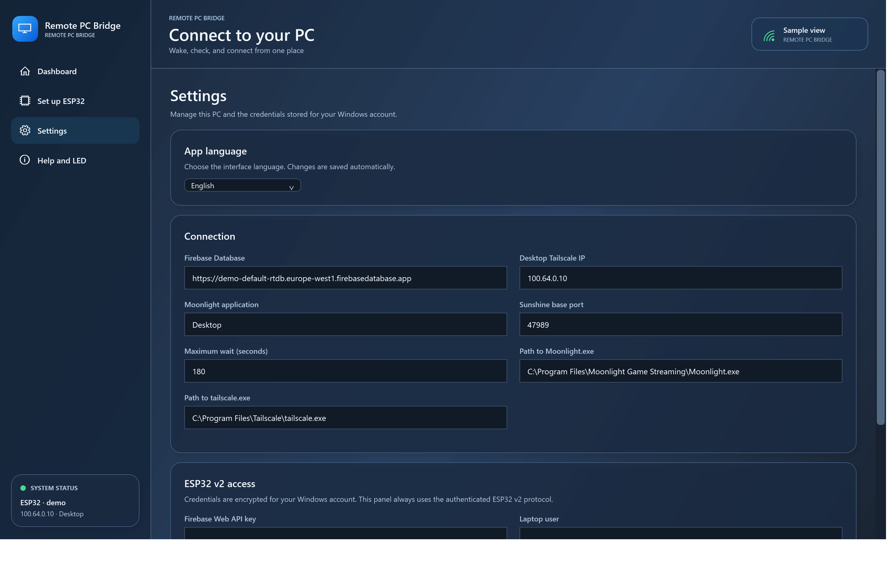

# Remote PC Bridge

**Wake a home Windows PC remotely, see where the connection fails, and launch Moonlight.** A Windows app writes an authenticated command to Firebase Realtime Database. An ESP32 on your home Wi-Fi reads that command and sends a Wake-on-LAN packet on the local network. The dashboard separately reports Firebase, ESP32 heartbeat, local Sunshine ports, Tailscale, remote ports, and Moonlight video.

This project targets **Windows 10/11 and an ESP32-WROOM-32 Dev Module with 4 MB flash**. The application passes automated tests and the firmware compiles. The USB flashing assistant has not yet been verified on a second physical board. The app starts in English; choose **Settings → App language → Español** to switch the interface.

## Requirements

- A desktop PC connected by Ethernet with Wake-on-LAN enabled in firmware and Windows.
- An ESP32-WROOM-32 on 2.4 GHz home Wi-Fi, powered even while the desktop is off, and a USB data cable for setup.
- [Sunshine](https://docs.lizardbyte.dev/projects/sunshine/latest/) and [Tailscale](https://tailscale.com/download) on the desktop; [Moonlight](https://moonlight-stream.org/) and Tailscale on the Windows laptop.
- A **dedicated** Firebase project with [Realtime Database](https://firebase.google.com/docs/database) and Email/Password Authentication.
- [.NET 8 Desktop Runtime](https://dotnet.microsoft.com/download/dotnet/8.0) on the laptop.

The desktop needs no extra agent from this project. Sunshine and Tailscale still need to be configured to start with Windows.

## Quick start

1. Enable Wake-on-LAN on the desktop and verify Sunshine, Tailscale, and Moonlight while you are at home. Record the desktop's Ethernet MAC, stable LAN IPv4, and Tailscale IPv4.
2. Create a dedicated Firebase project. Enable Realtime Database and Authentication → Email/Password. Copy the database root URL and Web API key.
3. Download the EXE from [Releases](https://github.com/Albjav12345/remote-pc-bridge/releases), or build it with the script below. Launch TorreRemota.exe.
4. In **Set up ESP32**, enter the Firebase, network, desktop, and home Wi-Fi details. **Create users and rules** creates two separate technical users with random passwords. Copy the generated rules and publish them in your Realtime Database Rules tab.
5. Connect the ESP32 over a USB data cable, select its COM port, and click **Flash and configure**. On first use the app downloads official esptool and verifies its SHA-256. It flashes a generic image and then sends your private configuration over USB. If it stalls at Connecting, hold BOOT until writing begins.
6. Keep the ESP32 powered at home, click **Run diagnostics**, and test **Wake and connect** with the desktop off. Finally test from another network.

The [detailed setup guide](docs/SETUP.md) covers each step, including how to find the Ethernet MAC and troubleshoot a missing COM port. BIOS/Windows Wake-on-LAN setup, third-party app installation, Firebase rule publication, and Sunshine pairing require manual access to those products.

## Language

English is the default. In **Settings → App language**, choose **Español** to switch immediately; the selection is saved for your Windows account. Choose **English** there to switch back.

## Daily use

**Wake and connect** checks whether Sunshine already responds, sends WOL only when needed, waits for startup, and opens Moonlight. **Wake only** sends WOL and shows the ESP32 acknowledgement. **Run diagnostics** checks every stage without waking the desktop. **Export** saves a diagnostic log. Closing the window exits the app; it installs no background process.

## What the indicators mean

The ESP32 sends a heartbeat with Wi-Fi signal, uptime, local TCP probes, and its last WOL acknowledgement. An acknowledgement of “sent” means the ESP32 submitted packets to its local UDP stack; it does **not** prove the PC received them or finished booting. Tailscale advertising a machine online does not establish a working data path. Open TCP ports do not prove video works; the app checks Moonlight's local log for its first received video packet.

| Built-in blue LED | Meaning |
|---|---|
| Three short flashes every 2 s | Waiting for USB configuration |
| Regular blinking | Looking for or reconnecting to Wi-Fi |
| One flash every 2 s | Waiting for NTP time to validate TLS |
| Two flashes every 2 s | Firebase or authentication error |
| Steady light | Wi-Fi and Firebase working |
| Brief off pulse while lit | Outgoing HTTPS request |
| Three long pulses | Sending WOL |

## How it works

~~~mermaid
flowchart LR
    L[Windows laptop Remote PC Bridge] -->|Authenticated HTTPS| F[(Firebase Realtime Database)]
    E[ESP32 at home] -->|Authenticated HTTPS| F
    E -->|WOL packet home LAN| P[Desktop PC]
    L <-->|Tailscale + Moonlight/Sunshine| P
~~~

Firebase holds a pending command, its latest acknowledgement, and recent ESP32 telemetry. Rules restrict reads and writes to the two generated user IDs. A command expires after 90 seconds; the ESP32 stores its ID before sending to avoid duplicates after a reboot. The firmware validates TLS.

## Build

Install .NET 8 SDK, Arduino CLI, ESP32 core **3.3.2**, and ArduinoJson **7.4.2**. On Windows PowerShell:

~~~powershell
./build.ps1
$p = Start-Process ./dist/TorreRemota.exe -ArgumentList '--self-test' -PassThru -Wait
Get-Content ./dist/test-results.txt
if ($p.ExitCode -ne 0) { throw 'Tests failed' }
~~~

The build embeds generic firmware in one EXE. The [build workflow](.github/workflows/build.yml) reproduces this in GitHub Actions; a version tag runs the [release workflow](.github/workflows/release.yml) to publish the EXE and its SHA-256. esptool is downloaded separately on first flash. The app stores passwords with Windows-user DPAPI; the ESP32 stores its configuration in NVS, which this project does **not** encrypt. See [security notes](SECURITY.md) and [contribution guide](CONTRIBUTING.md). Do not commit settings, logs, configured firmware, secrets, or real screenshots.

Repository code is [MIT licensed](LICENSE). esptool is downloaded separately under its own GPLv2-or-later license.
