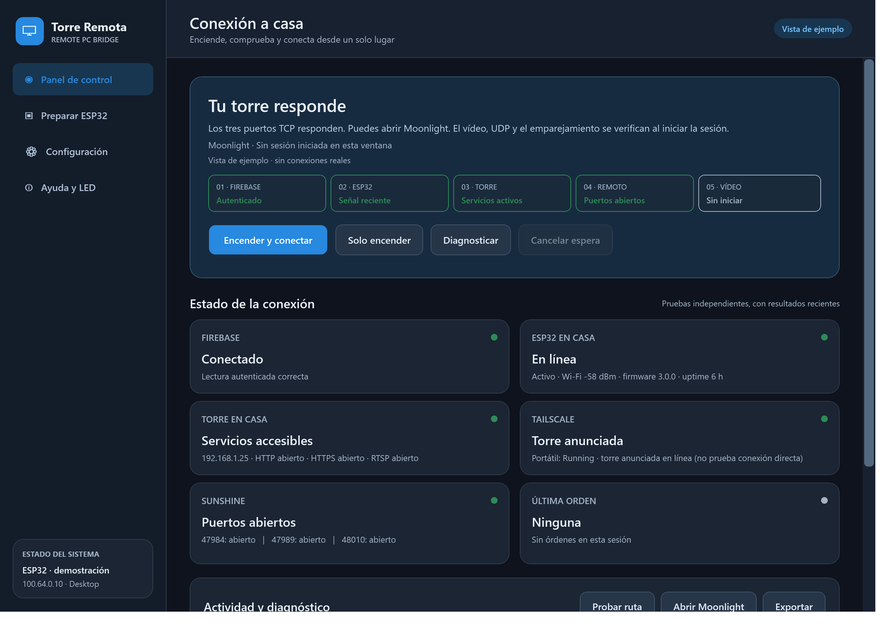
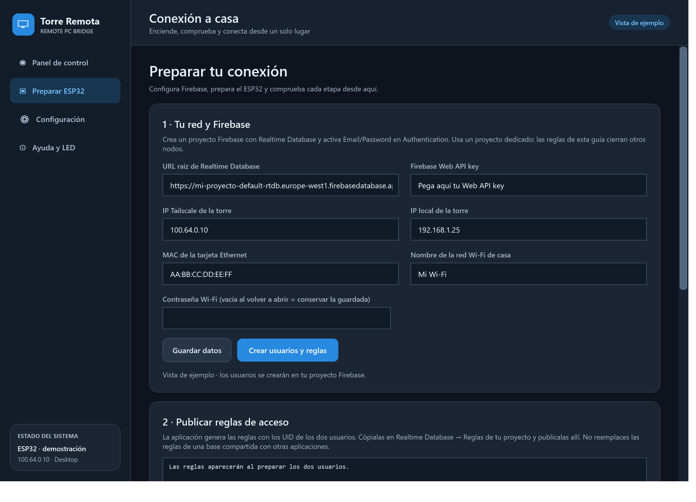
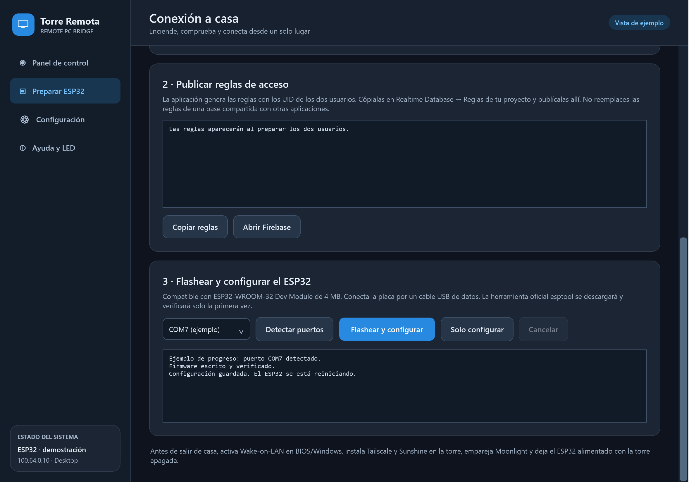

# Remote PC Bridge

[English](README.en.md)

**Enciende un PC de casa desde fuera y comprueba cada paso hasta abrir Moonlight.** Una aplicación de Windows envía una orden autenticada por Firebase; un ESP32 conectado al Wi-Fi doméstico la recibe y envía Wake-on-LAN a la torre. El panel comprueba por separado Firebase, el ESP32, los servicios de la torre, Tailscale, los puertos de Sunshine y la sesión de Moonlight.

> Estado: versión inicial para **Windows 10/11 y ESP32-WROOM-32 Dev Module con 4 MB de flash**. La aplicación pasa sus pruebas automáticas y el firmware compila. El asistente de flasheo todavía no se ha validado con otra placa física.

## Qué necesitas

| Componente | Dónde | Para qué |
|---|---|---|
| ESP32-WROOM-32 de 4 MB y cable USB de datos | En casa | Envía Wake-on-LAN mientras el PC está apagado |
| PC con Ethernet y Wake-on-LAN habilitado | En casa | Equipo que quieres encender |
| [Sunshine](https://docs.lizardbyte.dev/projects/sunshine/latest/) y [Tailscale](https://tailscale.com/download) | PC de casa | Streaming y acceso privado desde fuera |
| [Moonlight](https://moonlight-stream.org/) y Tailscale | Portátil Windows | Cliente de streaming y conexión remota |
| [Firebase Realtime Database](https://firebase.google.com/docs/database) y Authentication Email/Password | Proyecto propio dedicado | Canal autenticado entre portátil y ESP32 |
| [.NET 8 Desktop Runtime](https://dotnet.microsoft.com/download/dotnet/8.0) | Portátil | Ejecutar la aplicación |

El PC de casa **no necesita un agente adicional, servicio ni tarea de inicio de este proyecto**. Sí necesita que Sunshine y Tailscale estén configurados para funcionar cuando Windows arranque. El ESP32 debe quedar alimentado cuando la torre esté apagada; puede servir un puerto USB con alimentación permanente si lo compruebas en tu placa.

## Puesta en marcha

1. En la torre, activa Wake-on-LAN en UEFI/BIOS y en el adaptador Ethernet de Windows. Asigna una IP local estable, instala Sunshine y Tailscale y comprueba que Moonlight se empareja **antes de salir de casa**. Anota la IP local, la MAC de Ethernet y la IP Tailscale de la torre.
2. Crea un proyecto de Firebase **dedicado**. Activa Realtime Database y, en Authentication → Método de inicio de sesión, habilita Email/Password. Copia la URL raíz de Realtime Database y la Web API key de Configuración del proyecto. No uses una clave de cuenta de servicio.
3. Descarga el EXE de la sección Releases cuando haya una versión publicada, o compila el proyecto con el script de compilación. Abre TorreRemota.exe en el portátil. La primera apertura te lleva a **Preparar ESP32**.
4. Escribe los datos de Firebase, red, torre y Wi-Fi. Pulsa **Crear usuarios y reglas**. Se crean dos cuentas técnicas distintas, una para el portátil y otra para el ESP32, con contraseñas aleatorias. Copia las reglas generadas y publícalas en la pestaña **Reglas** de tu Realtime Database.
5. Conecta el ESP32 al portátil con un cable de datos, elige su puerto COM y pulsa **Flashear y configurar**. La app extrae el firmware genérico incluido, descarga esptool oficial de Espressif una sola vez, verifica su SHA-256 y escribe la placa. Luego envía los ajustes por USB. Si la escritura no empieza, mantén **BOOT** hasta que aparezca el progreso. **Solo configurar** sirve para cambiar los ajustes sin flashear de nuevo.
6. Alimenta el ESP32 en casa, comprueba que el LED azul queda fijo y pulsa **Diagnosticar**. Prueba **Encender y conectar** con la torre apagada y, finalmente, con el portátil fuera de la red doméstica.

La [guía de instalación](docs/INSTALACION.md) desarrolla cada paso, incluido cómo localizar la MAC y qué comprobar si el puerto COM no aparece. La aplicación guía la creación de cuentas y el flasheo; la activación de Wake-on-LAN, la instalación de Sunshine/Tailscale/Moonlight y la publicación de reglas requieren acceso a sus respectivas interfaces.

## Uso diario

**Encender y conectar** primero comprueba si Sunshine ya responde; si no, envía una orden WOL y espera el arranque antes de abrir Moonlight. **Solo encender** envía WOL y muestra el acuse sin abrir el cliente. **Diagnosticar** lee los estados sin encender nada. El panel se actualiza mientras la ventana está abierta, y **Exportar** guarda un registro para investigar fallos. Cerrar la ventana termina la aplicación; no instala un proceso en segundo plano.

El indicador de Tailscale «anunciada en línea» procede del plano de control y **no demuestra** que la conexión directa funcione. Un puerto TCP abierto tampoco confirma vídeo: la aplicación busca en el registro local de Moonlight el primer paquete de vídeo. El acuse «sent» confirma que el ESP32 entregó paquetes WOL a su pila UDP, **no** que el PC los haya recibido o completado el arranque.

| LED azul del ESP32 | Estado |
|---|---|
| Tres destellos cortos cada 2 s | Espera configuración USB |
| Parpadeo regular | Busca o recupera Wi-Fi |
| Un destello cada 2 s | Espera la hora NTP para validar TLS |
| Dos destellos cada 2 s | Error de autenticación o Firebase |
| Encendido fijo | Wi-Fi y Firebase operativos |
| Apagado breve sobre luz fija | Petición HTTPS saliente |
| Tres pulsos largos | Envío WOL |

## Cómo funciona

~~~mermaid
flowchart LR
    Y[Portátil Windows Remote PC Bridge] -->|HTTPS autenticado| F[(Firebase Realtime Database)]
    E[ESP32 en casa] -->|HTTPS autenticado| F
    E -->|Paquete WOL red local| P[PC de casa]
    Y <-->|Tailscale + Moonlight/Sunshine| P
~~~

Firebase almacena una orden pendiente, el último acuse y una señal reciente del ESP32 con RSSI, tiempo encendido y comprobaciones TCP locales. Las reglas limitan las lecturas y escrituras a dos UID concretos; la orden caduca a los 90 segundos y el ESP32 guarda su ID antes de enviar para evitar duplicados tras un reinicio. El firmware valida TLS.

La aplicación guarda la configuración en la carpeta Roaming AppData de TorreRemota y una copia de seguridad. Las contraseñas se protegen con DPAPI de la cuenta actual de Windows. Los registros locales se guardan en Local AppData. El firmware guarda sus credenciales en NVS del ESP32; quien tenga acceso físico y herramientas adecuadas al dispositivo podría extraerlas. Consulta [Seguridad](SECURITY.md) antes de reutilizar una placa o compartir registros.

## Compilar y colaborar

En Windows, instala [.NET 8 SDK](https://dotnet.microsoft.com/download/dotnet/8.0), [Arduino CLI](https://arduino.github.io/arduino-cli/) con el core esp32:esp32 **3.3.2** y ArduinoJson **7.4.2**. Luego:

~~~powershell
./build.ps1
Start-Process ./dist/TorreRemota.exe -ArgumentList '--self-test' -Wait
Get-Content ./dist/test-results.txt
~~~

El script compila el firmware genérico y publica un único EXE que lo lleva incrustado. El flujo [GitHub Actions](.github/workflows/build.yml) reproduce la compilación y ejecuta las pruebas en Windows; al enviar una etiqueta de versión, el flujo de [publicación](.github/workflows/release.yml) crea una descarga con su SHA-256. El EXE no incluye esptool: en el primer flasheo descarga la distribución oficial verificada de Espressif. La descarga ronda los 60 MB y requiere Internet. Consulta [CONTRIBUTING.md](CONTRIBUTING.md) para la estructura y las verificaciones.

Este repositorio contiene únicamente ejemplos y capturas de demostración. **No subas** ajustes, registros, firmware configurado, credenciales ni capturas con datos reales. La imagen de firmware incluida en el EXE es genérica y recibe la configuración por USB después de flashear.

Licencia del código de este repositorio: [MIT](LICENSE). esptool se descarga aparte y conserva su propia licencia GPLv2 o posterior.
